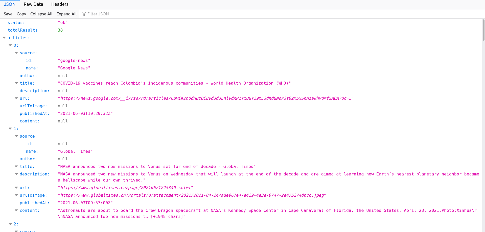

## NGINX and NodeJS on Docker with Docker-compose

#### News aggregator has been deployed on nginx servers with docker and docker compose

#### How to run?
1. Go to https://newsapi.org/ and get the api key.
2. In the backend folder, create a file called .env and add the following details:
```
API_URL = "https://newsapi.org/v2"
API_KEY = YOUR_API_KEY
```

2. In root folder, 
```
docker-compose up --build
```
#### Then visit localhost:3001 on browser
#### access api via localhost:3001/api

#### Screenshots:
1. Root

2. Search

3. API
